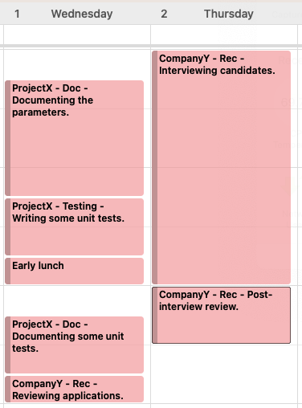
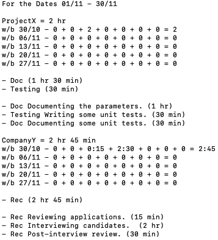

# TimeSheet: Summarising Outlook Timesheet Tasks

TimeSheet is a command line tool that reads calendar events from Microsoft Outlook that match a particular pattern and summarises them in a report on standard output.
The pattern identifies, for a given event, its project, sub-project and task details.

This version of TimeSheet is written in Go.
A version for .NET written in C# can be found [here](https://github.com/Vextasy/TimeSheet_CSharp).

TimeSheet will report on activity over time and have the individual activities summarised by project and sub-project in a format that makes it easy to see how much work has been done on individual projects, sub-projects within projects, or tasks within sub-projects. 

The interpretation of project, sub-project and task is very loose. The important part of the interpretation is that they are considered to be hierarchical such that a task is wholly contained within a sub-project and a sub-project is wholly contained within a project. 
Sometimes a project might be used to represent a customer and the sub-project might represent a distinct piece of work for that customer.

All is made clear by an example.
Consider the following entries made in Outlook between 10:00 and 13:00 on the 1st and 2nd of November.



TimeSheet examines Outlook for calendar entries that occur between a range of dates. These entries are known as events in Outlook.

Only entries whose text matches a given format are considered:

*\<project\> - \<sub-project\> - \<task details\>*

Project, sub-project and task detail are separated by a single dash character which may be surrounded by whitespace characters.
Project and sub-project may only contain letters, digits, an underscore character or a forward slash character.
Task details may contain any characters.

Entries with any other format are ignored.
So, from the entries above, the only Outlook task that is ignored is the "Early Lunch" task as it does not match the desired format.
All of the other tasks in our range of days are considered to be tasks of interest and are collected.

The duration of the task is taken from the duration of the corresponding Outlook event.

TimeSheet writes its output to standard output.
Given the data shown above, the diagram below shows the output produced by running TimeSheet on that data.



The first line shows the range of dates for which events in Outlook have been read.
In this example, TimeSheet has been asked to look at all dates between 1st November and 30th November (inclusive) but, to keep things simple, I have only made entries in Outlook for the days of 1st and 2nd of November.

After that comes a block of output for each distinct project found within those events.

Each block begins with a line containing the name of the project and the total time spent working on that project.

Then, for each week included in the range of days for which TimeSheet has been run, we see a breakdown of the time spent each day on the project (in hours and minutes). 
The weekly breakdown is arranged to begin on a Monday. In this example our data for the 1st and 2nd of November would appear in cells 3 and 4 of the row for the week beginning 30th October. We can see that we worked for 2 hours on Project X on the first of November and that this was the only week (so far) in the month that we have worked on ProjectX.

Next, for the project, we see a block of lines showing the total time that we have spent on each sub-project within the project.
We see that, for ProjectX, we have spent 1 hour 30 minutes on documentation and 30 minutes on testing.
This sub-project summary is only for sub-projects within the main project.
Were there to also be a Doc sub-project within, say, the CompanyY project then its Doc sub-project would be totalled separately.
So it is OK to have sub-projects with the same title within different projects and we will never double count them.

After the sub-projects block comes the task block.
The task block is more than just a list of tasks; it is a summary of the distinct tasks within the sub-projects.
So if multiple entries exist with the same project, sub-project and task detail they appear as just one line here and their total duration is summarised.
Working on a task, taking a break, and then working on the same task at some point later on will result in just a single line in this task block with the duration being the total time that has been spent on that task in the (project and sub-project and) date range.
Each line in the task block begins with the sub-project to which the task belongs.
This allows us to distinguish between tasks that have the same task detail within different sub-projects of a project.  

In summary, we use a very simple input format within an event in Outlook and we generate a textual output that enables us to see at a glance a summary of what we have been doing at the project, sub-project, task and day level.

# Authentication with Microsoft Entra ID

*Microsoft Entra ID was formerly known as Microsoft Azure Active Directory.*

## Configuration

The following configuration steps are required to arrange that our TimeSheet application can gain access to Outlook events through the Microsoft Graph service.

1. We will create an App Registration within Microsoft Entra ID. This will act as the representative of our application.
2. We will agree a shared secret that will be known to both the app registration and our application. When we run the application we can use this to prove to the app registration that we are who we claim to be.
3. We will grant the app registration permission to access the Microsoft Graph service.

### Creating the App Registration

Microsoft's documentation for the creation of an App Registration can be found here: [Register an application with the Microsoft identity platform](https://learn.microsoft.com/en-gb/entra/identity-platform/quickstart-register-app)

We'll give our app registration the name of "TimeSheet" and when asked "Who can use this application" we will select the option "Accounts in this organisational directory only". We will not be allowing access to our Outlook calendar to anyone other than us.

Click the "Register" button to create the app registration.
The overview page of the app registration will now show a value for the Application ID (also known as the Client ID).
This value will be used by our timesheet application to indicate to Microsoft Entra the app registration to which it is associated.

*In the Microsoft terminology our timesheet application is known as a "Confidential client application" in the sense that it is one that we can trust to safely keep an application secret - such as a shared password.
This is in contrast to, say, an application that ran in a web browser which would be considered to be a "Public client application"*

### Assigning a Shared Secret

We can now create a shared password that will allow our timesheet application to prove to the app registration that it is who it claims to be.
We do this from within the "Certificates & secrets" section of the app registration.
Select the "Client secrets" tab and click on "New client secret".
Enter a description such as "Timesheet shared secret" and choose an expiry period of 24 months (which is the longest that Microsoft Entra will allow us to set).

At this point it is very important to make a copy of the shared secret "Value".
This will be the only opportunity to capture it and so make a point of storing it safely. 
*To be clear, the sequence of characters that appears in the "Value" field is the one that we need to copy and not the "Secret ID" which is of no importance to us.*

We now have a Client ID and a shared secret.
These two things are sufficient to enable our password application to prove to the appropriate app registration that it is who it claims to be.

### Granting Permissions

We now need to give the app registration permission to use the Microsoft Graph service.
Still within the Microsoft Entra app registration we click on the API Permissions blade. 
You should see that, by default, the app registration already has the Microsoft.Graph User.Read permission.
This will allow the app registration to read the current users profile.
We will add a couple of additional permissions.

Click on "Add a permission" and choose Microsoft APIs -> Microsoft Graph -> Application Permissions.

Click to put a tick against: Calendars.Read and User.Read.All.
These allow us to "Read calendars in all mailboxes" and "Read all users' full profiles".

Click the "Add permissions" button.

The Calendars.Read and the User.Read.All permissions require admin consent before they can be used.
As long as we have the required administrative permission we can obtain these permissions by clicking on the "Grant admin consent for ..." button.
If this button is disabled it is because the logged in user does not have permission to do this.

Click the "Grant admin consent for ..." button (where the elipsis is replaced by the name of your Microsoft Entra tenant).

We should now have sufficient permission for our application, once suitably configured, to read Outlook calendar events.

## Authenticating to the Graph Service

Before we can make use of the Microsoft Graph service we need to prove to it that we are who we claim to be. And to do that we need to show it the shared secret that we agreed when we configured the Microsoft Entra app registration.

Microsoft have made this process much easier than it used to be by providing the Microsoft.Identity.Web.TokenAcquirerFactory class.
The TokenAcquirerFactory class will manage the acquisition of Access (and other) tokens required for communication with Microsoft Graph.

There are four pieces of information that we need to provide:

* **The Azure Instance**: In our case "https://login.microsoftonline.com". This will be different if you are allowing access to a wider audience. But if restricting it to just members of our Microsoft Entra tenant then we need to use this value.
* **The Azure Tenant ID**: This can be found from the app registration overview page as the Directory (tenant) ID.
*  **The App Registration Client ID**: Found on the app registration overview page.
* **The Client Secret**: The shared secret that we created on the app registration "Clients & Certificates" blade and which you saved to a safe place.

This information can be used with the TokenAcquirerFactory class to create a Microsoft Graph client with which we can query Microsoft Graph.

TimeSheet expects to find an ".envrc" file in the current directory that looks something like this:
```
export UserName="john.bates@oldgang.net",
export TenantId="g3xxxxxx-9999-xxxx-xxxx-1xxxx1x2xxxx",
export ClientId="xpxxxxf1-9999-4xxe-xxxx-dxxxx3x4x9x5",
export ClientSecret="kljkliexxxxxxxllxxxxxlxxxxxxCP(sGbYFwcWP"
```

# Usage

There are only three things that the TimeSheet application needs to know to produce some output: a starting date, an ending date and a user name.

The username, which is often the same for each invocation, is most usefully stored in the .envrc file. But an alternative username may be provided with the '-user' flag.

If run without any arguments the TimeSheet application will assume a date range that spans the start to the end (inclusive) of the current month.

The '-n' flag can be used to request a timesheet for 'n' months back from the current month and the date range that spans that month will be used.
So, for example, running:

```bash
./TimeSheet -n 1
```

will output a timesheet summary for the previous month.

The '-from' and '-to' flags may be used to provide alternative starting and ending dates.
The dates must be provided in the YYYY-MM-DD format and may be used in conjunction with the '-n' flag to modify the dates that the '-n- flag would imply.

So, for example, the following would only report on events in my calendar that happened on the first day of November 2023.

```bash
./TimeSheet -from '2023-11-01' -to '2023-11-01' -user 'john.bates@oldgang.net'
```

Because a time sheet can only be constructed after the event, and is most usefully constructed as soon after the event as possible, the most common invocation is:

```bash
./TimeSheet -n 1
```
to summarise last month's timesheet.